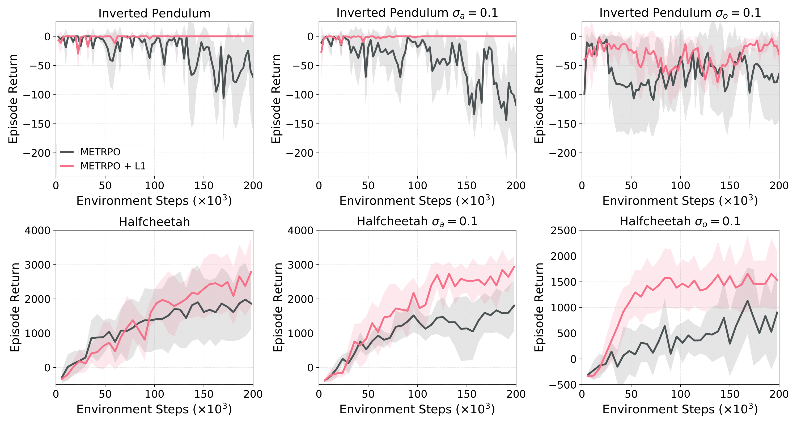
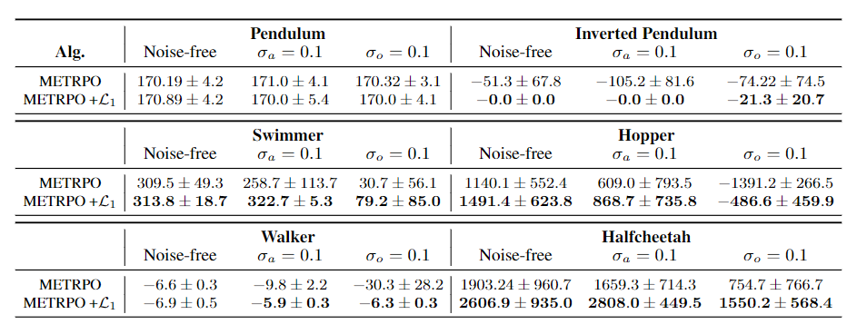

# Robust Adaptive Model Based Reinforcement Learning


We modified [this repo](https://github.com/WilsonWangTHU/mbbl-metrpo), which is the repo shared by the authors of MBBL-METRPO

## Authors

Minjun Sung

Sambhu H. Karumanchi

Aditya Gahlawat

Naira Hovakimyan


## RESULTS
<p align=center>

</p>
<p align=center>

</p>


## Prerequisites
You need a MuJoCo license, and download MuJoCo 1.31. from 
https://www.roboti.us/. 
Useful information for installing MuJoCo can be found at 
https://github.com/openai/mujoco-py.

## Create a Conda environment
It's recommended to create a new Conda environment for this repo:

```
conda create -n <env_name> python=3.5
```
Or you can use python 3.6.

## Install package dependencies

```
pip install -r requirements.txt
```

Then please go to [MBBL](https://github.com/WilsonWangTHU/mbbl) to install the mbbl package for the environments.

## Reproduce Results
To reproduce the results in the paper, please refer to `./metrpo_gym_search_new.sh` and also the figures can be found in the Results folder

## Run other experiments
Run experiments using the following command:

```python main.py --env <env_name> --exp_name <experiment_name> --sub_exp_name <exp_save_dir>```

- `env_name`: one of `(half_cheetah, ant, hopper, swimmer)`
- `exp_name`: what you want to call your experiment
- `sub_exp_name`: partial path for saving experiment logs and results

Experiment results will be logged to `./experiments/<exp_save_dir>/<experiment_name>`

e.g. `python main.py --env half_cheetah --exp_name test-exp --sub_exp_name test-exp-dir`


## Change configurations
You can modify the configuration parameters in `configs/params_<env_name>.json`.
